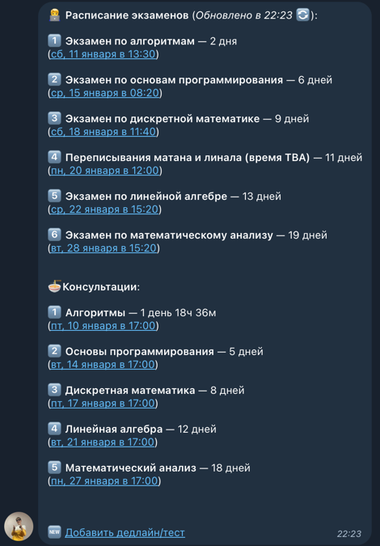

# Deadline reminder bot for M3104 group @ ITMO University

This bot is made for Telegram and is used to fetch deadlines and upcoming tests from a specific URL and send them to a specified Telegram groupchat as a reminder. The time remaining is also displayed and updated every minute. After 1 day, the message is deleted as it is expected that the new message is sent.



# Features
- Irrelevant deadlines are not shown automatically
- Tests and quizzes are shown in a separate section
- Every deadline has a countdown in a human-readable format (updated every minute)
- Deadline times have links for adding them to Google calendar
- There are versions for both deadlines + tests and exams + consultations (for exam period)

# Before first run
Before running this script, please ensure the following links and bot data is relevant for you and modify it at the top of the `main.py` file if needed:

```python
# Modify the links and data below:
DEADLINES_URL = "https://m3104.nawinds.dev/api-deadlines"  # URL of the json file with deadlines (see file description below)
ADD_DEADLINE_LINK = "https://m3104.nawinds.dev/deadlines-editing-instructions/"  # URL of the webpage for adding a new deadline to the file (usually GitHub file editing page)
BOT_NAME = "Дединсайдер M3104"
BOT_USERNAME = "m3104_deadliner_bot"  # username of the bot as it appears in Telegram
```

Also add the following environment variables:

```python
# Environment variables that should be available:
TOKEN = os.getenv("TOKEN")  # Bot token from t.me/botfather
MAIN_GROUP_ID = int(os.getenv("MAIN_GROUP_ID"))  # ID of the group the bot is expected to send deadlines to
```

# How to run
This is a very simple script that can be run as a cron job. Just configure the crontab to start `main.py` every day at a specific time and it will fetch the deadlines and send them to the specified group chat.
